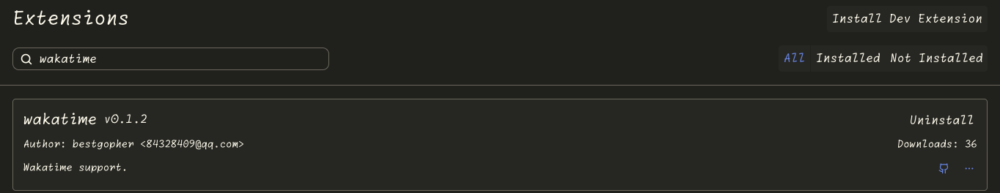

# WakaTime for Zed

[](https://zed.dev/extensions?query=wakatime)
[](https://github.com/wakatime/zed-wakatime/releases/latest)
[](./LICENSE)

Automatically track your coding activity in [Zed](https://zed.dev/) with
[WakaTime](https://wakatime.com/).

The extension listens for document open, edit, and save events, then sends
heartbeats to WakaTime without interrupting your workflow.

## Features

- Tracks coding activity across all languages registered by the extension.
- Reports the current file, language, cursor position, and project metadata.
- Sends save events immediately and throttles repeated edit heartbeats for the
  current file to once every two minutes.
- Uses an existing `wakatime-cli` from your shell `PATH`, or downloads it
  automatically when needed.
- Downloads and manages the matching `wakatime-ls` language server
  automatically.
- Supports macOS, Linux, and Windows on x86_64 and ARM64.

## How it works

```text
Zed document events -> wakatime-ls -> wakatime-cli -> WakaTime API
```

`wakatime-ls` translates Zed's language-server events into
[`wakatime-cli`](https://github.com/wakatime/wakatime-cli) heartbeats. The Zed
extension installs the required binaries, starts the language server, and
provides the current workspace as the WakaTime project.

## Installation

1. Open Zed's **Extensions** view.
2. Search for **WakaTime**.
3. Select **Install**.



The extension downloads `wakatime-ls` on first use. If `wakatime-cli` is not
available in your shell `PATH`, it downloads that as well.

## Configuration

Copy your secret API key from your
[WakaTime account settings](https://wakatime.com/settings/account), then choose
one of the following configuration methods.

### Option 1: WakaTime configuration file (recommended)

Create `~/.wakatime.cfg` (`%USERPROFILE%\.wakatime.cfg` on Windows):

```ini
[settings]
api_key = your-api-key
```

This configuration is shared with WakaTime integrations in other editors. See
the [`wakatime-cli` configuration reference](https://github.com/wakatime/wakatime-cli/blob/develop/USAGE.md)
for options such as project mappings, proxy settings, and file exclusions.

### Option 2: Zed settings

Open your Zed settings and add the API key under the `wakatime` language
server:

```jsonc
{
  "lsp": {
    "wakatime": {
      "initialization_options": {
        "api-key": "your-api-key"
      }
    }
  }
}
```

For a self-hosted or compatible WakaTime API, you can also provide `api-url`:

```jsonc
{
  "lsp": {
    "wakatime": {
      "initialization_options": {
        "api-key": "your-api-key",
        "api-url": "https://wakatime.example.com/api/v1"
      }
    }
  }
}
```

Reload the workspace or restart Zed after changing the configuration so the
language server receives the new values.

> [!IMPORTANT]
> Treat your WakaTime API key like a password. Do not commit it to this or any
> other repository.

## Troubleshooting

- **No activity appears:** confirm that the API key is valid, reload Zed, edit
  and save a file, then allow a few minutes for the WakaTime dashboard to
  update.
- **A binary cannot be downloaded:** check access to GitHub Releases. You can
  also install `wakatime-cli` yourself and ensure it is available in the shell
  `PATH` inherited by Zed.
- **Need more detail:** run the `zed: open log` command and search the log for
  `Wakatime` or `wakatime-ls` messages.

Prebuilt binaries are configured for macOS, Linux, and Windows, but macOS is
currently the most thoroughly tested platform. Please
[open an issue](https://github.com/wakatime/zed-wakatime/issues) with your OS,
CPU architecture, Zed version, and relevant logs if you encounter a problem.

## Development

The repository contains two Rust crates:

- `zed-wakatime`: the Zed extension that installs and launches the required
  binaries.
- `wakatime-ls`: the language server that converts document events into
  WakaTime heartbeats.

Run the standard workspace checks before submitting a change:

```bash
cargo fmt --all --check
cargo clippy --workspace --all-targets
cargo test --workspace
```

Contributions and bug reports are welcome.

## License

This project is available under the [MIT License](./LICENSE).
